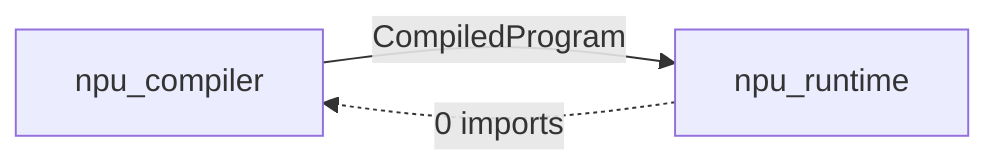

# 백엔드 포팅 가이드

NPU 시뮬레이션 프로젝트에 새로운 실행 백엔드(CUDA, Vulkan, WebGPU, 실제 NPU ASIC 등)를 추가하는 방법을 설명합니다.

## 의존성 구조

컴파일러와 런타임은 **단방향 의존** 관계입니다. 런타임이 컴파일러에 의존하지만, 컴파일러는 런타임을 전혀 모릅니다.



런타임이 컴파일러에서 가져오는 7개 데이터 구조:

| 타입 | 정의 위치 | 역할 |
|------|----------|------|
| `CompiledProgram` | compiled_program.py | 직렬화된 컴파일 결과 (.npubin) |
| `KernelCall` | codegen.py | 커널 디스패치 사양 |
| `BufferAllocation` | codegen.py | 중간 버퍼 할당 정보 |
| `ExecutionPlan` | codegen.py | 커널 + 버퍼 + 스펙 묶음 |
| `TensorSpec` | ir_reader.py | shape/dtype/transform 계약 |
| `TargetConfig` | target_config.py | 하드웨어 디스패치 파라미터 |
| `WeightTransformRecipe` | graph_optimizer.py | 가중치 변환 레시피 (BN fold 등) |

런타임에서 컴파일러를 import하는 파일:

| 런타임 모듈 | 컴파일러 import |
|---|---|
| `executor.py` | `KernelCall`, `CompiledProgram`, `TargetConfig`, `METAL_GPU` |
| `weight_loader.py` | `CompiledProgram`, `WeightTransformRecipe` |
| `metal_backend.py` | `TargetConfig`, `METAL_GPU` |
| `_mps_accel.py` | `KernelCall` |
| `buffer.py` | `TensorSpec` (TYPE_CHECKING 전용) |

## 기존 추상화 계층

3개의 확장 포인트가 이미 준비되어 있습니다:

### 1. 컴파일러: `CodegenTarget` (codegen.py)

ATen 연산을 백엔드별 커널 파일에 매핑합니다.

```python
class CodegenTarget(ABC):
    def elementwise_kernel(self, kernel_name: str) -> tuple[str, str]: ...
    def matmul_kernel(self, is_vec: bool, transpose_b: bool) -> tuple[str, str]: ...
    def fused_kernel(self, kernel_type: str) -> tuple[str, str]: ...
    def shader_source(self, filename: str) -> str: ...
```

현재 구현: `MetalCodegenTarget` (`.metal` 파일로 매핑).

### 2. 런타임: `Backend` + `DeviceBuffer` (backend.py)

버퍼 관리를 포함한 추상 실행 백엔드입니다.

```python
class DeviceBuffer(ABC):
    shape, alloc_shape, dtype, size_bytes, native_handle
    def to_numpy(self, spec=None) -> np.ndarray: ...

class Backend(ABC):
    def allocate_buffer(self, data, alloc_shape, spec) -> DeviceBuffer: ...
    def allocate_zeros(self, shape, dtype, alloc_shape) -> DeviceBuffer: ...
    def execute(self, program, inputs, weights) -> dict[str, DeviceBuffer]: ...
    def create_executor(self, program) -> Any: ...
    def synchronize(self): ...
```

현재 구현: `MetalBackend` (`Device`, `NPUBuffer`, `Executor` 래핑).

### 3. 런타임: `DispatchStrategy` (executor.py)

커널별 그리드/스레드그룹 크기를 계산합니다.

```python
class DispatchStrategy(ABC):
    def compute_dispatch(self, call: KernelCall, pipeline) \
        -> tuple[tuple[int,int,int], tuple[int,int,int]] | None: ...
```

현재 구현: `MetalDispatchStrategy` (`TargetConfig` 파라미터 사용).

## 포팅 대상

### 작업 범위 요약

```
npu_compiler/                         npu_runtime/
  target_config.py  + 새 인스턴스       backend.py        (변경 없음)
  codegen.py        + 새 CodegenTarget metal_backend.py  (변경 없음)
                                        + new_backend.py  (신규)
                                        + new_executor.py (신규)
                                        + new_buffer.py   (신규)

new_kernels/                          (신규 디렉토리)
  elementwise.cu / .spv / ...
  matmul.cu / .spv / ...
  ...
```

### Step 1: `TargetConfig` 인스턴스 추가

```python
# target_config.py
CUDA_GPU = TargetConfig(
    name="cuda_gpu",
    channel_alignment_bytes=128,
    channel_tile=64,
    matmul_tile=32,
    max_threadgroup_1d=1024,
    max_threadgroup_2d=32,
    max_threadgroup_3d_xy=16,
    max_threadgroup_3d_z=8,
    max_dispatches_per_batch=65535,
)
```

### Step 2: `CodegenTarget` 구현

```python
class CudaCodegenTarget(CodegenTarget):
    def elementwise_kernel(self, kernel_name: str) -> tuple[str, str]:
        return (kernel_name, "elementwise.cu")

    def matmul_kernel(self, is_vec: bool, transpose_b: bool) -> tuple[str, str]:
        name = "matmul_vec" if is_vec else "matmul_tiled"
        return (name, "matmul.cu")

    def fused_kernel(self, kernel_type: str) -> tuple[str, str]:
        return (kernel_type, f"{kernel_type}.cu")

    def shader_source(self, filename: str) -> str:
        return filename
```

### Step 3: 커널/셰이더 파일 포팅

Metal → CUDA 매핑:

| Metal 셰이더 | CUDA 대응 |
|-------------|-----------|
| `matmul.metal` | cuBLAS `cublasGemmEx` 또는 커스텀 `matmul.cu` |
| `elementwise_extended.metal` | `elementwise.cu` (문법 변환) |
| `softmax.metal` | `softmax.cu` |
| `rmsnorm.metal` | `rmsnorm.cu` |
| `rope.metal` | `rope.cu` |
| `embedding.metal` | `embedding.cu` |
| `tensor_ops.metal` | `tensor_ops.cu` |
| `fused_decode_attention.metal` | `fused_decode_attention.cu` |

Element-wise 커널은 문법 차이만 있어 기계적 포팅이 가능합니다. Matmul은 cuBLAS 사용이 성능상 권장됩니다.

### Step 4: 런타임 구현 (3개 파일)

**버퍼** (`cuda_buffer.py`):

```python
class CudaBuffer(DeviceBuffer):
    """cupy 또는 pycuda 기반 CUDA 디바이스 버퍼."""
    # native_handle -> cupy.ndarray 또는 device pointer
    # to_numpy() -> cupy.asnumpy()
```

**실행기** (`cuda_executor.py`):

```python
class CudaExecutor:
    """CUDA GPU에서 CompiledProgram 실행."""
    # CUDA stream 기반 커맨드 배칭
    # Metal command buffer  -> CUDA stream
    # Metal compute encoder -> CUDA kernel launch
    # Metal MPS matmul      -> cuBLAS GEMM
```

**백엔드** (`cuda_backend.py`):

```python
class CudaBackend(Backend):
    def create_executor(self, program) -> CudaExecutor:
        return CudaExecutor(program, self._device, config=CUDA_GPU)
```

### Step 5: 진입점 연결

```python
# 타겟 지정하여 컴파일
program = npu_compiler.compile("model_ir.json", target=CudaCodegenTarget())

# 백엔드 선택하여 실행
backend = CudaBackend()
executor = backend.create_executor(program)
outputs = executor.run(inputs, weights)
```

## 현재 구조의 장단점

잘 되어 있는 것:

- `Backend`/`DeviceBuffer` ABC가 공개 인터페이스를 정의
- `CodegenTarget` ABC로 컴파일러의 셰이더 매핑 분리
- `DispatchStrategy` ABC로 그리드 계산 분리
- `CompiledProgram`이 직렬화 경계 (백엔드 독립적)

개선이 필요한 것:

| 이슈 | 위치 | 영향 |
|------|------|------|
| `Executor`가 통째로 Metal 전용 | executor.py | 백엔드마다 새 Executor 작성 필요 |
| `_PARAM_SPECS`가 Metal struct 레이아웃에 고정 | executor.py:347 | 다른 백엔드는 다른 레이아웃 필요 |
| `weight_loader.py`가 `NPUBuffer` 직접 반환 | weight_loader.py | 범용화하려면 `DeviceBuffer` 반환 필요 |
| `compile()` API에 `CodegenTarget` 파라미터 미연결 가능 | `__init__.py` | 연결 확인 필요 |

핵심 요약: **컴파일러 변경은 최소** (CodegenTarget 구현 + TargetConfig 인스턴스), **런타임은 3개 파일 신규 작성** (buffer, executor, backend). 기존 Metal 코드는 변경 불필요.

## 구현 사례: CUDA 백엔드

CUDA 백엔드가 레퍼런스로 구현되어 있습니다. Metal 백엔드(기존 op 수준 코드 생성 재사용)와 달리, CUDA 백엔드는 **서브그래프 수준** 접근 방식을 보여줍니다:

| 구성 요소 | 파일 | 접근 방식 |
|-----------|------|-----------|
| 컴파일러 | `cuda_compiler/` (7개 파일) | 서브그래프 분석 + 탐욕적 elementwise 퓨전 + NVRTC JIT |
| 런타임 | `cuda_runtime/` (2개 파일) | CuPy 기반: cuBLAS (BLAS용), RawKernel (퓨전 커널용) |
| DAGExecutor | `npu_runtime/dag_executor.py` | `compile_fn` 파라미터로 확장 |

핵심 설계 결정:

- **채널 패딩 불필요**: CUDA는 64바이트 정렬 제약이 없음 (Metal과 다름)
- **탐욕적 퓨전**: 단일 소비자 elementwise op 체인 중 형상이 일치하면 하나의 커널로 퓨전
- **CuPy 경유 BLAS**: GEMM에 `cp.matmul()` 사용, 커스텀 matmul 커널 불필요
- **초기화 시 JIT**: 모든 NVRTC 컴파일은 `CUDAExecutor.__init__()`에서 수행

자세한 내용은 [CUDA 백엔드 가이드](cuda-backend.md)를 참조하세요.
