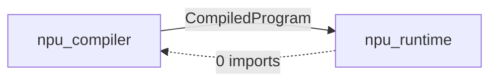

# Backend Porting Guide

How to add a new execution backend (e.g. CUDA, Vulkan, WebGPU, or a real NPU ASIC) to the NPU simulation project.

## Dependency Structure

The compiler and runtime have a **one-way dependency**: runtime depends on compiler, but compiler has zero knowledge of runtime.



The runtime imports 7 data structures from the compiler:

| Type | Defined in | Role |
|------|-----------|------|
| `CompiledProgram` | compiled_program.py | Serialized compilation result (.npubin) |
| `KernelCall` | codegen.py | Kernel dispatch specification |
| `BufferAllocation` | codegen.py | Intermediate buffer allocation info |
| `ExecutionPlan` | codegen.py | Kernels + buffers + specs bundle |
| `TensorSpec` | ir_reader.py | Shape/dtype/transform contract |
| `TargetConfig` | target_config.py | Hardware dispatch parameters |
| `WeightTransformRecipe` | graph_optimizer.py | Weight transform recipe (BN fold, etc.) |

Runtime files that import from compiler:

| Runtime Module | Compiler Imports |
|---|---|
| `executor.py` | `KernelCall`, `CompiledProgram`, `TargetConfig`, `METAL_GPU` |
| `weight_loader.py` | `CompiledProgram`, `WeightTransformRecipe` |
| `metal_backend.py` | `TargetConfig`, `METAL_GPU` |
| `_mps_accel.py` | `KernelCall` |
| `buffer.py` | `TensorSpec` (TYPE_CHECKING only) |

## Existing Abstraction Layers

Three extension points are already in place:

### 1. Compiler: `CodegenTarget` (codegen.py)

Maps ATen ops to backend-specific kernel file references.

```python
class CodegenTarget(ABC):
    def elementwise_kernel(self, kernel_name: str) -> tuple[str, str]: ...
    def matmul_kernel(self, is_vec: bool, transpose_b: bool) -> tuple[str, str]: ...
    def fused_kernel(self, kernel_type: str) -> tuple[str, str]: ...
    def shader_source(self, filename: str) -> str: ...
```

Current implementation: `MetalCodegenTarget` (maps to `.metal` files).

### 2. Runtime: `Backend` + `DeviceBuffer` (backend.py)

Abstract execution backend with buffer management.

```python
class DeviceBuffer(ABC):
    shape, alloc_shape, dtype, size_bytes, native_handle
    def to_numpy(self, spec=None) -> np.ndarray: ...

class Backend(ABC):
    def allocate_buffer(self, data, alloc_shape, spec) -> DeviceBuffer: ...
    def allocate_zeros(self, shape, dtype, alloc_shape) -> DeviceBuffer: ...
    def execute(self, program, inputs, weights) -> dict[str, DeviceBuffer]: ...
    def create_executor(self, program) -> Any: ...
    def synchronize(self): ...
```

Current implementation: `MetalBackend` (wraps `Device`, `NPUBuffer`, `Executor`).

### 3. Runtime: `DispatchStrategy` (executor.py)

Computes grid/threadgroup sizes per kernel.

```python
class DispatchStrategy(ABC):
    def compute_dispatch(self, call: KernelCall, pipeline) \
        -> tuple[tuple[int,int,int], tuple[int,int,int]] | None: ...
```

Current implementation: `MetalDispatchStrategy` (uses `TargetConfig` parameters).

## What Needs Porting

### Scope Summary

```
npu_compiler/                         npu_runtime/
  target_config.py  + new instance      backend.py        (no change)
  codegen.py        + new CodegenTarget metal_backend.py  (no change)
                                        + new_backend.py  (new)
                                        + new_executor.py (new)
                                        + new_buffer.py   (new)

new_kernels/                          (new directory)
  elementwise.cu / .spv / ...
  matmul.cu / .spv / ...
  ...
```

### Step 1: Add `TargetConfig` Instance

```python
# target_config.py
CUDA_GPU = TargetConfig(
    name="cuda_gpu",
    channel_alignment_bytes=128,
    channel_tile=64,
    matmul_tile=32,
    max_threadgroup_1d=1024,
    max_threadgroup_2d=32,
    max_threadgroup_3d_xy=16,
    max_threadgroup_3d_z=8,
    max_dispatches_per_batch=65535,
)
```

### Step 2: Implement `CodegenTarget`

```python
class CudaCodegenTarget(CodegenTarget):
    def elementwise_kernel(self, kernel_name: str) -> tuple[str, str]:
        return (kernel_name, "elementwise.cu")

    def matmul_kernel(self, is_vec: bool, transpose_b: bool) -> tuple[str, str]:
        name = "matmul_vec" if is_vec else "matmul_tiled"
        return (name, "matmul.cu")

    def fused_kernel(self, kernel_type: str) -> tuple[str, str]:
        return (kernel_type, f"{kernel_type}.cu")

    def shader_source(self, filename: str) -> str:
        return filename
```

### Step 3: Port Kernel/Shader Files

Metal to CUDA mapping:

| Metal Shader | CUDA Equivalent |
|-------------|-----------------|
| `matmul.metal` | cuBLAS `cublasGemmEx` or custom `matmul.cu` |
| `elementwise_extended.metal` | `elementwise.cu` (syntax conversion) |
| `softmax.metal` | `softmax.cu` |
| `rmsnorm.metal` | `rmsnorm.cu` |
| `rope.metal` | `rope.cu` |
| `embedding.metal` | `embedding.cu` |
| `tensor_ops.metal` | `tensor_ops.cu` |
| `fused_decode_attention.metal` | `fused_decode_attention.cu` |

Element-wise kernels are mechanical ports (syntax differences only). Matmul should use cuBLAS for performance.

### Step 4: Implement Runtime (3 files)

**Buffer** (`cuda_buffer.py`):

```python
class CudaBuffer(DeviceBuffer):
    """DeviceBuffer backed by a CUDA device pointer (via cupy or pycuda)."""
    # native_handle -> cupy.ndarray or device pointer
    # to_numpy() -> cupy.asnumpy()
```

**Executor** (`cuda_executor.py`):

```python
class CudaExecutor:
    """Executes CompiledProgram on CUDA GPU."""
    # CUDA stream-based command batching
    # Metal command buffer  -> CUDA stream
    # Metal compute encoder -> CUDA kernel launch
    # Metal MPS matmul      -> cuBLAS GEMM
```

**Backend** (`cuda_backend.py`):

```python
class CudaBackend(Backend):
    def create_executor(self, program) -> CudaExecutor:
        return CudaExecutor(program, self._device, config=CUDA_GPU)
```

### Step 5: Wire Up Entry Points

```python
# Compile with target
program = npu_compiler.compile("model_ir.json", target=CudaCodegenTarget())

# Execute with backend
backend = CudaBackend()
executor = backend.create_executor(program)
outputs = executor.run(inputs, weights)
```

## Current Limitations

Things that work well:

- `Backend`/`DeviceBuffer` ABCs define the public interface
- `CodegenTarget` ABC separates shader mapping in the compiler
- `DispatchStrategy` ABC separates grid computation
- `CompiledProgram` is the serialization boundary (backend-agnostic)

Things that need attention:

| Issue | Location | Impact |
|-------|----------|--------|
| `Executor` is entirely Metal-specific | executor.py | Must write a new executor per backend |
| `_PARAM_SPECS` hardcodes Metal struct layout | executor.py:347 | Other backends may need different layouts |
| `weight_loader.py` returns `NPUBuffer` directly | weight_loader.py | Should return `DeviceBuffer` for generality |
| `compile()` API may not expose `CodegenTarget` param | `__init__.py` | Needs to be wired through |

The key takeaway: **compiler changes are minimal** (CodegenTarget + TargetConfig), **runtime requires 3 new files** (buffer, executor, backend). Existing Metal code remains untouched.
