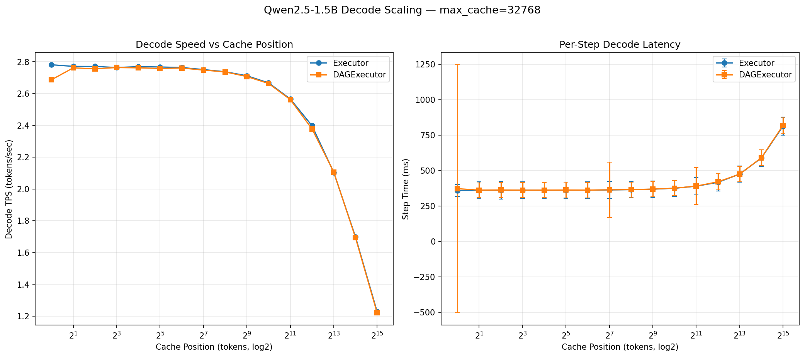
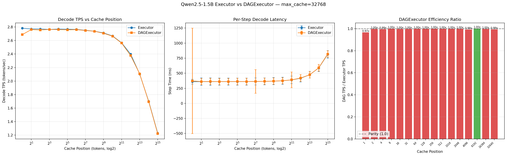

# 벤치마크

Metal GPU 백엔드에서 실행되는 Qwen2.5-1.5B-Instruct 성능 벤치마크입니다.

## 측정 방법

- **모델**: Qwen2.5-1.5B-Instruct (BFloat16)
- **접근법**: 로그 스케일 캐시 위치에서 단일 스텝 타이밍 (전체 디코드 루프 불필요)
- **측정**: 위치당 3회 측정, 중앙값 및 표준편차 기록
- **지표**: TTFT (첫 토큰까지 시간), TPS (초당 토큰 수), Step Time (ms)

각 캐시 위치에서 KV 캐시를 랜덤 데이터로 채우고 단일 디코드 스텝의 시간을
측정합니다. 이를 통해 autoregressive 오버헤드 없이 디코드 지연 시간을 분리하고,
컨텍스트 길이에 따른 성능 스케일링을 측정합니다.

### 테스트 위치

위치는 1에서 `max_cache_len - prefill_seq_len`까지 log₂ 스케일로 생성됩니다:

```
1, 2, 4, 8, 16, 32, 64, 128, 256, 512, 1024, ...
```

## 결과

!!! note "실행 환경"
    Apple M4 Pro, 48 GB RAM, macOS 26.2, Python 3.14.0.
    결과는 하드웨어에 따라 달라질 수 있습니다.

### 스케일링 결과 (max_cache_len=32768)

| Position | Executor TPS | Executor Step (ms) | DAG TPS | DAG Step (ms) | Ratio |
|----------|-------------|-------------------|---------|---------------|-------|
| 1 | 2.8 | 359.5 | 2.7 | 372.1 | 0.97x |
| 2 | 2.8 | 360.8 | 2.8 | 362.1 | 1.00x |
| 4 | 2.8 | 360.9 | 2.8 | 362.8 | 0.99x |
| 8 | 2.8 | 361.8 | 2.8 | 361.8 | 1.00x |
| 16 | 2.8 | 361.1 | 2.8 | 362.1 | 1.00x |
| 32 | 2.8 | 361.3 | 2.8 | 362.5 | 1.00x |
| 64 | 2.8 | 361.8 | 2.8 | 362.2 | 1.00x |
| 128 | 2.8 | 363.5 | 2.7 | 363.9 | 1.00x |
| 256 | 2.7 | 365.3 | 2.7 | 365.5 | 1.00x |
| 512 | 2.7 | 368.7 | 2.7 | 369.4 | 1.00x |
| 1024 | 2.7 | 374.9 | 2.7 | 375.4 | 1.00x |
| 2048 | 2.6 | 389.7 | 2.6 | 390.3 | 1.00x |
| 4096 | 2.4 | 417.1 | 2.4 | 420.6 | 0.99x |
| 8192 | 2.1 | 475.3 | 2.1 | 474.6 | 1.00x |
| 16384 | 1.7 | 588.4 | 1.7 | 590.3 | 1.00x |
| 32640 | 1.2 | 813.6 | 1.2 | 818.2 | 0.99x |

| 지표 | 값 |
|------|-----|
| 컴파일 시간 | 0.19 sec |
| 가중치 로딩 시간 | 1.44 sec |
| DAG/Executor TPS 비율 | ~1.00x |

### 차트



**패널 1 — TPS vs 캐시 위치**: KV 캐시 크기에 따른 디코드 처리량 (log₂ x축).
Executor와 DAGExecutor가 비교를 위해 겹쳐 표시됩니다.

**패널 2 — Step Time vs 캐시 위치**: 오차 막대가 있는 스텝별 디코드 지연 시간 (log₂ x축).

### Executor vs DAGExecutor 비교



**패널 1 — TPS vs 캐시 위치**: Executor와 DAGExecutor 디코드 속도 오버레이.

**패널 2 — Step Time vs 캐시 위치**: 오차 막대가 있는 지연 시간 비교.

**패널 3 — 효율 비율**: 각 위치에서 Executor 대비 DAGExecutor TPS 비율.
1.0에 가까울수록 파티션 오버헤드가 적음을 의미합니다.

## 재현 방법

```bash
# 1. IR 추출 (transformers + torch 필요)
cd examples/
python extract_qwen_ir.py --prefill-seq-len 128 --max-cache-len 32768

# 2. 통합 벤치마크 실행 (Executor + DAGExecutor)
python ../benchmarks/benchmark_qwen.py \
    --mode both \
    --chart-dir ../docs/assets/ \
    --json ../benchmarks/results/benchmark_results.json

# 또는 하나의 executor만 실행:
python ../benchmarks/benchmark_qwen.py --mode executor --chart chart.png
python ../benchmarks/benchmark_qwen.py --mode dag --chart chart.png
```

## JSON 결과

전체 결과는 `benchmarks/results/`에 저장되며, 자동화된 분석 및 CI 통합에 활용할 수 있습니다:

- `benchmark_results.json` — Executor + DAGExecutor 통합 스케일링 결과
