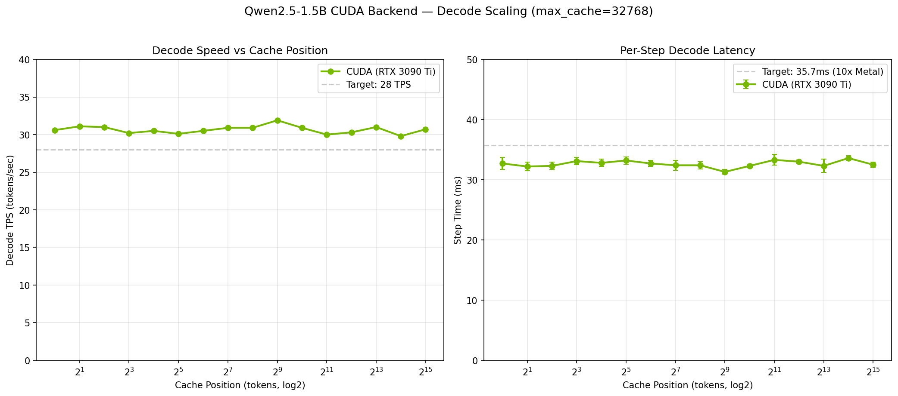
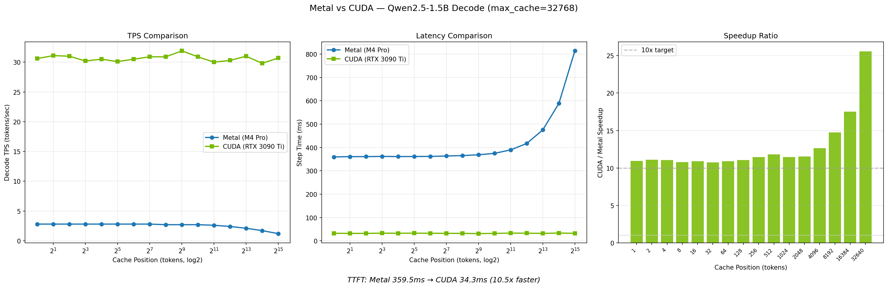

# Benchmarks

Performance benchmarks for Qwen2.5-1.5B-Instruct running on the Metal GPU backend.

## Methodology

- **Model**: Qwen2.5-1.5B-Instruct (BFloat16)
- **Approach**: Single-step timing at log-scale cache positions (avoids full decode loops)
- **Measurement**: 3 measurements per position, reporting median and stddev
- **Metrics**: TTFT (Time To First Token), TPS (Tokens Per Second), Step Time (ms)

At each cache position, a KV cache is filled with random data and a single
decode step is timed. This isolates decode latency from autoregressive overhead
and measures how performance scales with context length.

### Test Positions

Positions are generated on a log₂ scale from 1 to `max_cache_len - prefill_seq_len`:

```
1, 2, 4, 8, 16, 32, 64, 128, 256, 512, 1024, ...
```

## Results

!!! note "Environment"
    Apple M4 Pro, 48 GB RAM, macOS 26.2, Python 3.14.0.
    Results may vary depending on hardware.

### Scaling Results (max_cache_len=32768)

| Position | Executor TPS | Executor Step (ms) | DAG TPS | DAG Step (ms) | Ratio |
|----------|-------------|-------------------|---------|---------------|-------|
| 1 | 2.8 | 359.5 | 2.7 | 372.1 | 0.97x |
| 2 | 2.8 | 360.8 | 2.8 | 362.1 | 1.00x |
| 4 | 2.8 | 360.9 | 2.8 | 362.8 | 0.99x |
| 8 | 2.8 | 361.8 | 2.8 | 361.8 | 1.00x |
| 16 | 2.8 | 361.1 | 2.8 | 362.1 | 1.00x |
| 32 | 2.8 | 361.3 | 2.8 | 362.5 | 1.00x |
| 64 | 2.8 | 361.8 | 2.8 | 362.2 | 1.00x |
| 128 | 2.8 | 363.5 | 2.7 | 363.9 | 1.00x |
| 256 | 2.7 | 365.3 | 2.7 | 365.5 | 1.00x |
| 512 | 2.7 | 368.7 | 2.7 | 369.4 | 1.00x |
| 1024 | 2.7 | 374.9 | 2.7 | 375.4 | 1.00x |
| 2048 | 2.6 | 389.7 | 2.6 | 390.3 | 1.00x |
| 4096 | 2.4 | 417.1 | 2.4 | 420.6 | 0.99x |
| 8192 | 2.1 | 475.3 | 2.1 | 474.6 | 1.00x |
| 16384 | 1.7 | 588.4 | 1.7 | 590.3 | 1.00x |
| 32640 | 1.2 | 813.6 | 1.2 | 818.2 | 0.99x |

| Metric | Value |
|--------|-------|
| Compile time | 0.19 sec |
| Weight load time | 1.44 sec |
| DAG/Executor TPS ratio | ~1.00x |

### Charts


**Panel 1 — TPS vs Cache Position**: Shows how decode throughput scales with KV cache size (log₂ x-axis).
Both Executor and DAGExecutor lines are overlaid for comparison.

**Panel 2 — Step Time vs Cache Position**: Per-step decode latency with error bars (log₂ x-axis).

### Executor vs DAGExecutor Comparison


**Panel 1 — TPS vs Cache Position**: Executor and DAGExecutor decode speed overlay.

**Panel 2 — Step Time vs Cache Position**: Latency comparison with error bars.

**Panel 3 — Efficiency Ratio**: DAGExecutor TPS as a fraction of Executor TPS at each position.
Values near 1.0 indicate minimal partition overhead.

## CUDA Backend Benchmarks

!!! note "Environment"
    NVIDIA RTX 3090 Ti, Ubuntu (WSL2), Python 3.14.0, CuPy.
    Results may vary depending on hardware and driver version.

### CUDA Scaling Results (max_cache_len=32768)

| Position | CUDA TPS | CUDA Step (ms) | Metal TPS | Metal Step (ms) | Speedup |
|----------|----------|----------------|-----------|-----------------|---------|
| 1 | 30.6 | 32.7 | 2.8 | 359.5 | 10.9x |
| 2 | 31.1 | 32.2 | 2.8 | 360.8 | 11.1x |
| 4 | 31.0 | 32.3 | 2.8 | 360.9 | 11.1x |
| 8 | 30.2 | 33.1 | 2.8 | 361.8 | 10.8x |
| 16 | 30.5 | 32.8 | 2.8 | 361.1 | 10.9x |
| 32 | 30.1 | 33.2 | 2.8 | 361.3 | 10.8x |
| 64 | 30.5 | 32.7 | 2.8 | 361.8 | 10.9x |
| 128 | 30.9 | 32.4 | 2.8 | 363.5 | 11.0x |
| 256 | 30.9 | 32.4 | 2.7 | 365.3 | 11.4x |
| 512 | 31.9 | 31.3 | 2.7 | 368.7 | 11.8x |
| 1024 | 30.9 | 32.3 | 2.7 | 374.9 | 11.4x |
| 2048 | 30.0 | 33.3 | 2.6 | 389.7 | 11.5x |
| 4096 | 30.3 | 33.0 | 2.4 | 417.1 | 12.6x |
| 8192 | 31.0 | 32.3 | 2.1 | 475.3 | 14.8x |
| 16384 | 29.8 | 33.6 | 1.7 | 588.4 | 17.5x |
| 32640 | 30.7 | 32.5 | 1.2 | 813.6 | 25.6x |

| Metric | Metal (M4 Pro) | CUDA (RTX 3090 Ti) | Speedup |
|--------|----------------|---------------------|---------|
| TTFT | 359.5 ms | 34.3 ms | 10.5x |
| Peak TPS | 2.8 tok/s | 31.9 tok/s | 11.4x |
| Compile time | 0.19 sec | 0.33 sec | — |

### CUDA Charts



**Panel 1 — TPS vs Cache Position**: CUDA decode throughput stays flat (~30 TPS) regardless of cache size,
unlike Metal which degrades significantly at longer contexts.

**Panel 2 — Step Time vs Cache Position**: Per-step latency remains under 35ms at all cache positions.

### Metal vs CUDA Comparison



**Panel 1 — TPS**: CUDA delivers 10-25x higher throughput than Metal across all cache positions.

**Panel 2 — Latency**: CUDA maintains flat ~33ms latency while Metal increases from 360ms to 814ms.

**Panel 3 — Speedup Ratio**: The speedup grows with context length because CUDA's flat scaling contrasts
with Metal's linear degradation. At 32K tokens, CUDA is 25x faster.

### Key Optimizations

The CUDA backend's performance comes from several optimizations (see [CUDA_OPTIMIZATION.md](https://github.com/user/repo/blob/main/CUDA_OPTIMIZATION.md)):

1. **CuPy zero-copy views** — expand, transpose, slice use CuPy native views instead of CUDA kernels
2. **GQA-aware BMM fusion** — exploits Grouped Query Attention structure (batch=2 instead of batch=12)
3. **Fused reduction kernels** — RMSNorm (6→1 dispatch), SiLU+Gate (2→1), Masked Softmax (2→1)
4. **GPU-resident KV cache** — eliminates PCIe host→device transfer per decode step
5. **NVRTC kernel cache** — module-level compilation cache avoids redundant JIT
6. **Dispatch table pre-building** — eliminates isinstance checks in the hot loop

### Running CUDA Benchmarks

```bash
# CUDA-only DAG benchmark
python ../benchmarks/benchmark_qwen.py --mode dag --backend cuda

# With charts
python ../benchmarks/benchmark_qwen.py --backend cuda --chart-dir ../docs/assets/

# Metal vs CUDA comparison
python ../benchmarks/benchmark_qwen.py --mode dag --backend both
```

!!! note
    CUDA benchmarks require CuPy (`uv sync --extra cuda`) and an NVIDIA GPU.

## Reproducing

```bash
# 1. Extract IR (requires transformers + torch)
cd examples/
python extract_qwen_ir.py --prefill-seq-len 128 --max-cache-len 32768

# 2. Run integrated benchmark (Executor + DAGExecutor, Metal)
python ../benchmarks/benchmark_qwen.py \
    --mode both \
    --chart-dir ../docs/assets/ \
    --json ../benchmarks/results/benchmark_results.json

# Or run only one executor type:
python ../benchmarks/benchmark_qwen.py --mode executor --chart chart.png
python ../benchmarks/benchmark_qwen.py --mode dag --chart chart.png

# CUDA backend:
python ../benchmarks/benchmark_qwen.py --mode dag --backend cuda --chart cuda_chart.png
```

## JSON Results

Full results are saved to `benchmarks/results/` for automated analysis and CI integration:

- `benchmark_results.json` — Combined Executor + DAGExecutor scaling results
