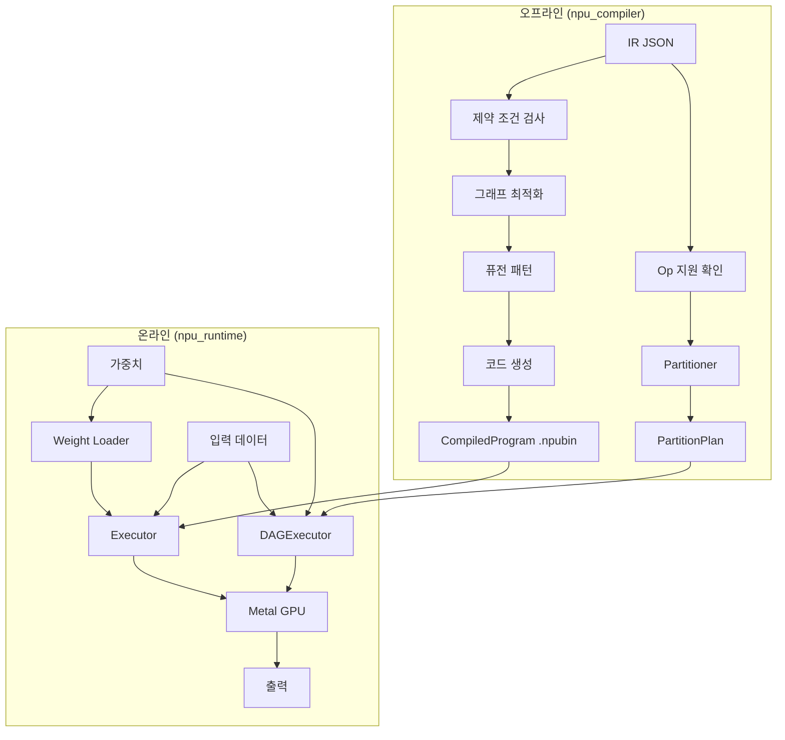

# 개념 및 아키텍처

## 파이프라인 개요

NPU 시뮬레이션 파이프라인은 **오프라인 컴파일**과 **온라인 실행** 두 단계로 구성됩니다. **단일 프로그램** (모든 op NPU 지원)과 **그래프 파티션** (NPU + CPU 혼합) 두 가지 실행 경로가 있습니다.

## 컴파일러 파이프라인

### IR Reader
`torch_to_ir` JSON 형식을 내부 `IRGraph` 표현으로 로드합니다. IR에는 다음이 포함됩니다:

- **graph_inputs/outputs** — 형상(shape)과 dtype이 포함된 텐서 명세
- **weights** — 형상 메타데이터가 포함된 모델 파라미터
- **nodes** — 연산 그래프 (각 노드: op_type, inputs, outputs, attrs)
- **weight_name_mapping** — FX placeholder 이름 -> state_dict 키 매핑

### Constraint Checker
단일 프로그램 `compile()` 경로의 NPU 제약 조건 검증:

- **정적 형상** — 모든 텐서 형상은 컴파일 시점에 결정
- **채널 정렬** — 4D 텐서 채널을 64의 배수로 패딩
- **지원 연산** — 미지원 연산 타입 거부 (파티션 경로에서는 미지원 op이 CPU로 라우팅)

### Op Support + Partitioner
미지원 op이 있는 모델의 경우, 파티션 경로가 IR을 분할합니다:

- **op_support.py** — `is_op_supported(op_type)`로 50+ 지원 op 확인
- **partitioner.py** — `partition(ir_dict, is_supported_fn)`이 동일 target 연속 노드를 그룹핑하고, 디바이스 경계에 `TransferOp`을 삽입하여 `PartitionPlan` 반환

자세한 내용은 [그래프 파티셔닝](partitioning.ko.md)을 참조하세요.

### Graph Optimizer
- **BN 폴딩** — BatchNorm을 Conv2d 가중치에 병합
- **Noop 제거** — 항등 연산 제거

### Fusion Patterns
다중 연산 패턴을 감지하여 단일 커널로 퓨전:

| 패턴 | 퓨전 연산 | 커널 |
|------|-----------|------|
| Conv+BN+ReLU | conv2d, batch_norm, relu | `conv2d_kernel` (플래그) |
| Add+ReLU | add, relu | `add_relu_kernel` |
| RMSNorm | pow, mean, add, rsqrt, expand, mul, mul | `rmsnorm_kernel` |
| SiLU+Mul | silu, mul | `silu_mul_kernel` |
| Masked Softmax | add, softmax | `masked_softmax_kernel` |

### Code Generator
각 연산을 Metal 커널 호출로 매핑:

- 커널 이름 및 Metal 소스 파일
- 입출력 버퍼 바인딩
- 파라미터 구조체 (`struct.pack`으로 패킹)
- 디스패치 유형 (1D/2D/3D) 및 그리드 크기

후처리 패스:

- **Broadcast 폴딩** — expand+이진 연산을 단일 broadcast 커널로 대체
- **Transpose 폴딩** — transpose를 MPS matmul transpose 플래그로 병합

## 런타임

### Device
Metal 디바이스 래퍼 (pyobjc 기반):

- Metal 라이브러리 컴파일 (`.metal` -> MTLLibrary)
- 파이프라인 상태 생성
- 커맨드 버퍼/인코더 관리

### Buffer (NPUBuffer)
GPU 메모리 관리:

- `from_numpy()` — dtype 변환 및 패딩과 함께 업로드
- `to_numpy()` — 디패딩 및 dtype 변환과 함께 다운로드
- `zeros()` — `alloc_shape` 옵션으로 제로 초기화 버퍼 할당

### Executor
모든 커널 디스패치를 Metal 커맨드 버퍼로 배치:

- **MPS 가속** — matmul에 `MPSMatrixMultiplication` 사용 (float16 + bfloat16)
- **사전 컴파일 파이프라인** — 초기화 시 모든 셰이더 컴파일
- **사전 패킹 파라미터** — 파라미터 버퍼 1회 패킹, 실행 시 재사용
- **버퍼 풀** — 중간 버퍼 초기화 시 1회 할당

### Weight Loader
safetensors 가중치를 변환 레시피와 함께 로드:

- BN 폴딩 (running_mean/var를 conv 가중치에 병합)
- Dtype 변환 (float32 -> float16/bfloat16)
- 채널 패딩 (64 원소 정렬)

### Backend ABC + MetalBackend
하드웨어 독립적 NPU 실행 인터페이스:

- `Backend` — `create_executor()`, `allocate_buffer()`, `device` 속성을 가진 추상 기반 클래스
- `MetalBackend` — pyobjc 기반 Metal GPU 구현
- `CUDABackend` — CuPy 기반 NVIDIA GPU 구현 ([CUDA 백엔드](cuda-backend.md) 참조)
- `DeviceBuffer` — `to_numpy()` / `from_numpy()`를 가진 디바이스 메모리 추상화

### DAGExecutor
`PartitionPlan`에 따라 NPU + CPU 혼합 실행을 오케스트레이션:

- NPU 파티션은 초기화 시 `npu_compiler.compile(sub_ir_dict)` (Metal) 또는 `cuda_compiler.compile_subgraph(sub_ir_dict)` (CUDA)로 컴파일
- CPU 파티션은 `torch_ir.IRExecutor`로 실행 (ATen fallback)
- Transfer op이 디바이스 간 텐서 이동 (bfloat16 dtype 보존)
- `load_weights()`로 NPU 가중치 버퍼를 사전 캐시하여 실행 간 재사용
- `compile_fn` 파라미터로 사용할 컴파일러 선택 (Metal 또는 CUDA)

### CPU Fallback
`execute_cpu_partition()`이 `torch_ir.IRExecutor`를 사용하여 미지원 op을 CPU에서 실행합니다. `ml_dtypes`를 통한 bfloat16 포함 numpy↔torch 텐서 변환을 처리합니다.

## 연산 Dtype

파이프라인은 두 가지 연산 타입을 지원합니다:

| Dtype | Metal 타입 | 용도 |
|-------|-----------|------|
| float16 | `half` | CNN 모델 (ResNet) |
| bfloat16 | `bfloat` | LLM 모델 (Qwen) |

IR 가중치 dtype을 기반으로 자동 선택됩니다. Metal 셰이더는 `#ifdef USE_BFLOAT`로 적절한 타입을 선택합니다.
