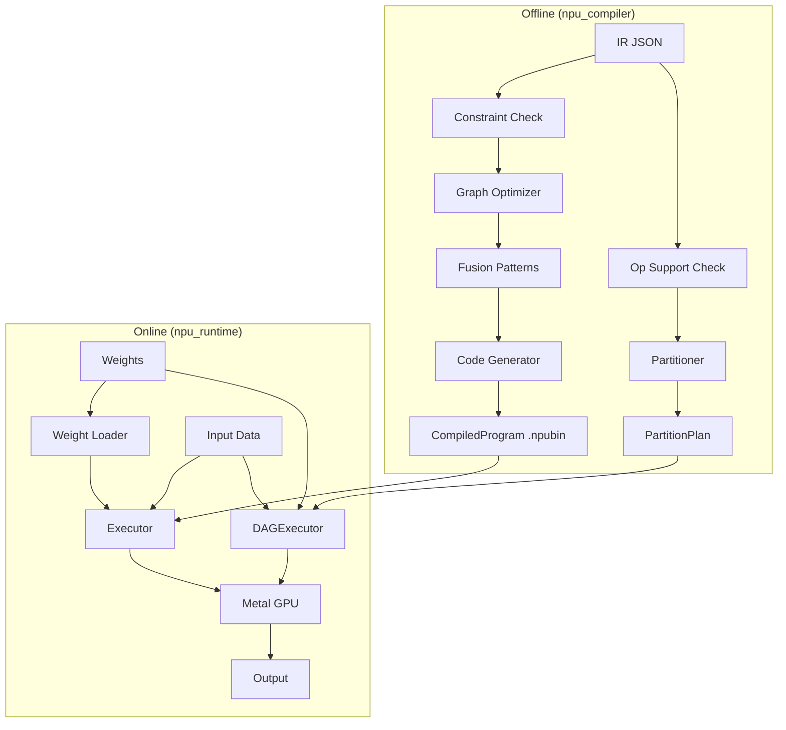

# Concepts & Architecture

## Pipeline Overview

The NPU simulation pipeline has two phases: **offline compilation** and **online execution**. There are two execution paths: **single program** (all ops NPU-supported) and **graph partition** (mixed NPU + CPU).

## Compiler Pipeline

### IR Reader
Loads `torch_to_ir` JSON format into an internal `IRGraph` representation. The IR contains:

- **graph_inputs/outputs** — tensor specifications with shapes and dtypes
- **weights** — model parameters with shape metadata
- **nodes** — operation graph (each node has op_type, inputs, outputs, attrs)
- **weight_name_mapping** — maps FX placeholder names to state_dict keys

### Constraint Checker
Validates NPU constraints for the single-program `compile()` path:

- **Static shapes** — all tensor shapes must be compile-time constants
- **Channel alignment** — 4D tensor channels padded to multiples of 64
- **Supported ops** — rejects unsupported operation types (for the partition path, unsupported ops are routed to CPU instead)

### Op Support + Partitioner
For models with unsupported ops, the partition path splits the IR:

- **op_support.py** — `is_op_supported(op_type)` checks against 50+ supported ops
- **partitioner.py** — `partition(ir_dict, is_supported_fn)` groups consecutive same-target nodes, inserts `TransferOp` at device boundaries, returns a `PartitionPlan`

See [Graph Partitioning](partitioning.md) for details.

### Graph Optimizer
- **BN folding** — folds BatchNorm into Conv2d weights
- **Noop elimination** — removes identity operations

### Fusion Patterns
Detects multi-op patterns and fuses them into single kernels:

| Pattern | Ops Fused | Kernel |
|---------|-----------|--------|
| Conv+BN+ReLU | conv2d, batch_norm, relu | `conv2d_kernel` (flags) |
| Add+ReLU | add, relu | `add_relu_kernel` |
| RMSNorm | pow, mean, add, rsqrt, expand, mul, mul | `rmsnorm_kernel` |
| SiLU+Mul | silu, mul | `silu_mul_kernel` |
| Masked Softmax | add, softmax | `masked_softmax_kernel` |

### Code Generator
Maps each operation to Metal kernel calls with:

- Kernel name and Metal source file
- Input/output buffer bindings
- Parameter struct (packed via `struct.pack`)
- Dispatch type (1D/2D/3D) and grid dimensions

Post-processing passes:

- **Broadcast folding** — replaces expand+binary op with single broadcast kernel
- **Transpose folding** — folds transpose into MPS matmul transpose flags

## Runtime

### Device
Wraps the Metal device (via pyobjc) for:

- Metal library compilation (`.metal` -> MTLLibrary)
- Pipeline state creation
- Command buffer/encoder management

### Buffer (NPUBuffer)
GPU memory management:

- `from_numpy()` — upload with optional dtype cast and padding
- `to_numpy()` — download with optional depad and dtype cast
- `zeros()` — allocate zero-filled buffer with optional `alloc_shape`

### Executor
Batches all kernel dispatches into Metal command buffers:

- **MPS acceleration** — uses `MPSMatrixMultiplication` for matmul (float16 + bfloat16)
- **Pre-compiled pipelines** — all shaders compiled at init
- **Pre-packed params** — parameter buffers packed once, reused across runs
- **Buffer pool** — intermediate buffers allocated once at init

### Weight Loader
Loads safetensors weights with transform recipes:

- BN folding (fold running_mean/var into conv weights)
- Dtype conversion (float32 -> float16/bfloat16)
- Channel padding (to 64-element alignment)

### Backend ABC + MetalBackend
Hardware-agnostic interface for NPU execution:

- `Backend` — abstract base class with `create_executor()`, `allocate_buffer()`, `device` property
- `MetalBackend` — Metal GPU implementation via pyobjc
- `DeviceBuffer` — device memory abstraction with `to_numpy()` / `from_numpy()`

### DAGExecutor
Orchestrates mixed NPU + CPU execution from a `PartitionPlan`:

- NPU partitions compiled via `npu_compiler.compile(sub_ir_dict)` at init time
- CPU partitions executed via `torch_ir.IRExecutor` (ATen fallback)
- Transfer ops move tensors between devices (bfloat16 dtype preserved)
- `load_weights()` pre-caches NPU weight buffers for reuse across runs

### CPU Fallback
`execute_cpu_partition()` runs unsupported ops on CPU using `torch_ir.IRExecutor`. Handles numpy↔torch tensor conversion including bfloat16 via `ml_dtypes`.

## Compute Dtype

The pipeline supports two compute types:

| Dtype | Metal Type | Use Case |
|-------|-----------|----------|
| float16 | `half` | CNN models (ResNet) |
| bfloat16 | `bfloat` | LLM models (Qwen) |

Selected automatically based on IR weight dtypes. Metal shaders use `#ifdef USE_BFLOAT` to select the appropriate type.
