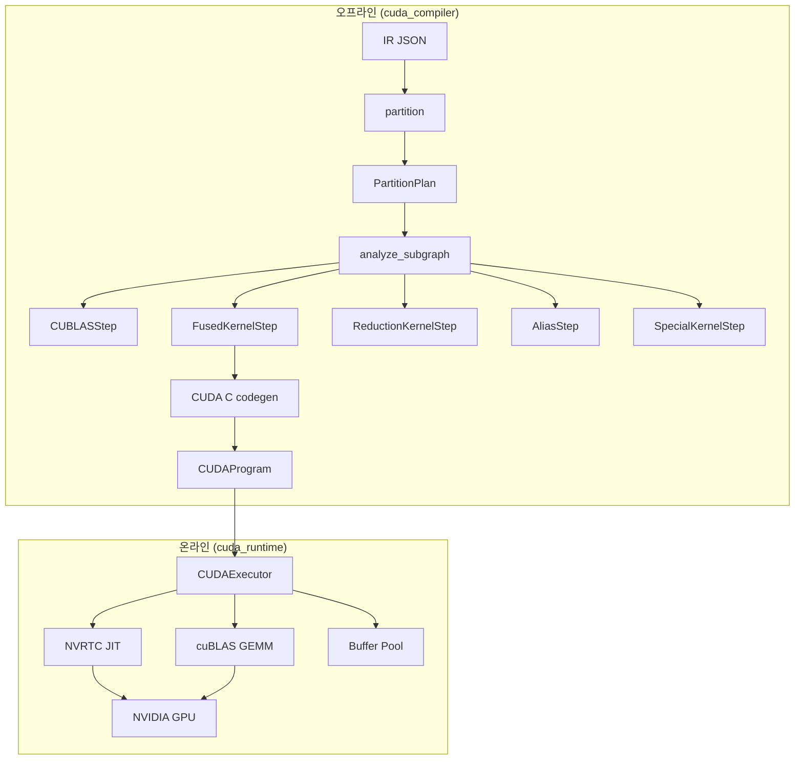

# CUDA 백엔드 가이드

CUDA 백엔드는 CuPy를 통해 NVIDIA GPU에서 실행하는 대안 경로를 제공합니다. Metal 백엔드의 op-level codegen (1 ATen op → 1 커널)과 달리, CUDA 백엔드는 **subgraph-level codegen** (N ops → M fused 커널, M << N)을 사용합니다.

## 아키텍처



## Subgraph 컴파일 파이프라인

```
sub_ir_dict
  → IRGraph (ir_reader.py, npu_compiler에서 재사용)
  → analyze_subgraph(graph) → list[ExecStep]
     ├─ CUBLASStep       (matmul, conv, linear, bmm → cuBLAS)
     ├─ FusionGroup       (elementwise chain → 단일 CUDA 커널)
     ├─ ReductionKernelStep (softmax, mean → 커스텀 CUDA 커널)
     ├─ AliasStep         (reshape, view → zero-cost)
     └─ SpecialKernelStep (embedding, rope, index_copy → 사전 작성)
  → codegen: FusionGroup → CUDA C 소스코드 (NVRTC JIT)
  → CUDAProgram (실행 step + 버퍼 할당)
```

## Op 분류

연산은 4가지 카테고리로 분류됩니다:

| 카테고리 | 연산 | 처리 방식 |
|---------|------|----------|
| **ANCHOR_BLAS** | matmul, conv2d, linear, bmm, addmm | cuBLAS (fusion barrier) |
| **ELEMENTWISE** | relu, silu, add, mul, div, neg, pow, rsqrt, cos, sin | Chain fusion → 단일 커널 |
| **REDUCTION** | softmax, mean, pool, batchnorm | 커스텀 CUDA 커널 (fusion barrier) |
| **SHAPE_ALIAS** | reshape, view, expand, slice, transpose | Zero-cost alias 또는 커널 |

## Fusion 전략

Greedy elementwise fusion 알고리즘:

1. Op 그래프를 위상 정렬 순서로 순회
2. 각 ELEMENTWISE op에 대해 primary input producer가 기존 chain에 있는지 확인
3. Producer가 single-consumer이고 shape이 일치하면 → chain 확장
4. Multi-consumer 노드와 비-elementwise op는 **fusion barrier**
5. 완료된 각 chain이 단일 `FusedKernelStep`이 됨

**예시** — Qwen MLP (`linear → silu → mul → linear`):

```
Step 0: cuBLAS GEMM (gate_proj)
Step 1: cuBLAS GEMM (up_proj)
Step 2: Fused kernel [silu, mul]  ← silu(gate) * up 단일 커널
Step 3: cuBLAS GEMM (down_proj)
```

## 런타임 최적화

CUDA executor는 기본적인 커널 디스패치 외에 여러 최적화를 적용합니다:

### CuPy Zero-Copy 뷰

텐서 조작 연산 (expand, transpose, slice)은 커스텀 CUDA 커널 대신 CuPy 네이티브 뷰 연산을 사용합니다:

| 연산 | 커널 방식 | CuPy 뷰 방식 |
|------|---------|-------------|
| expand | 요소별 복사 커널 | `cp.broadcast_to()` (zero-copy) |
| transpose | 요소별 복사 커널 | `ndarray.transpose()` (zero-copy) |
| slice | 요소별 복사 커널 | `ndarray[slices]` (zero-copy) |
| cat | N/A | `cp.concatenate()` (최적화된 복사) |

KV 캐시 텐서 (840만 요소)의 경우 뷰 연산 시간이 ~200ms에서 <1ms로 감소합니다.

### GQA 인식 어텐션 Fusion

Grouped Query Attention을 사용하는 모델 (예: Qwen2.5, Q 12헤드, KV 2헤드)에서
expand→reshape→[transpose]→matmul 패턴을 감지하여 `gemm_gqa`로 대체합니다:

```
이전: KV [1,2,1,S,D] → [1,12,S,D] 확장 → batch=12 BMM
이후: KV 헤드당 batch=2 GEMM [6,D] @ [D,S] (확장 불필요)
```

`subgraph_analyzer.py`의 `_try_match_gqa_attention`이 두 가지 변형을 감지합니다:

- **QK^T**: Q=[1,H,1,D] @ K^T=[1,H,D,S] → [kv, q_per_kv, D] @ [kv, D, S]
- **Score×V**: Scores=[1,H,1,S] @ V=[1,H,S,D] → [kv, q_per_kv, S] @ [kv, S, D]

### Fused Reduction 커널

다중 연산 패턴을 컴파일 시점에 매칭하여 단일 커널로 실행합니다:

| 패턴 | 이전 | 이후 |
|------|------|------|
| RMSNorm | pow→mean→add→rsqrt→mul→mul (6 dispatch) | 1 warp-parallel 커널 |
| SiLU+Gate | silu→mul (2 dispatch) | 1 elementwise 커널 |
| Masked Softmax | add→softmax (2 dispatch) | 1 warp-parallel 커널 |

### NVRTC 커널 캐시

모듈 레벨 `_KERNEL_CACHE`가 `md5(source_code) + kernel_name` 키로 컴파일된 커널을 저장합니다.
CUDAExecutor 인스턴스 간에 공유되어 중복 NVRTC 컴파일을 제거합니다.

### 디스패치 테이블 사전 빌드

`run()` 핫 루프는 스텝별 `isinstance()` 체크 대신 사전 빌드된 디스패치 테이블
(`(dispatch_fn, step)` 튜플 리스트)을 사용하여 Python 오버헤드를 줄입니다.

## Metal vs CUDA 비교

| 항목 | Metal 백엔드 | CUDA 백엔드 |
|------|-------------|------------|
| 플랫폼 | macOS (Apple Silicon) | Linux/Windows (NVIDIA GPU) |
| 런타임 | pyobjc + Metal API | CuPy (NVRTC + cuBLAS) |
| Codegen | Op-level (1:1) | Subgraph-level (N:M) |
| Fusion | 패턴 기반 (Conv+BN+ReLU 등) | Greedy elementwise chain + 다중 연산 패턴 |
| 채널 패딩 | 64-byte alignment | 없음 (DENSE layout) |
| JIT 컴파일러 | Metal shader compiler | NVRTC (모듈 레벨 캐시) |
| BLAS | MPS MatrixMultiplication | cuBLAS via CuPy |
| GQA 최적화 | N/A | GQA 인식 BMM fusion |
| 뷰 연산 | 커스텀 Metal 커널 | CuPy zero-copy 뷰 |
| nvcc 필요 | N/A | 불필요 (NVRTC는 런타임 JIT) |

### 성능 비교

| 지표 | Metal (M4 Pro) | CUDA (RTX 3090 Ti) | Speedup |
|------|----------------|---------------------|---------|
| TTFT | 359.5 ms | 34.3 ms | 10.5x |
| Peak TPS | 2.8 tok/s | 31.9 tok/s | 11.4x |
| 32K 컨텍스트 TPS | 1.2 tok/s | 30.7 tok/s | 25.6x |

전체 스케일링 결과와 차트는 [벤치마크](benchmarks.ko.md#cuda-백엔드-벤치마크)를 참조하세요.

## 사용법

```python
import json
from cuda_compiler import compile_subgraph
from cuda_compiler.op_support import is_cuda_op_supported
from npu_compiler.partitioner import partition
from npu_runtime.dag_executor import DAGExecutor
from cuda_runtime.cuda_backend import CUDABackend

# IR 로드
ir_dict = json.load(open("model_ir.json"))

# 파티션
plan = partition(ir_dict, is_cuda_op_supported)

# 실행
backend = CUDABackend()
dag = DAGExecutor(plan, backend, compile_fn=compile_subgraph)
dag.load_weights(weights_dict)
result = dag.execute(inputs={"x": input_np})
```

## 검증

```bash
# 단위 테스트 (CuPy 불필요 — 오프라인 컴파일만 테스트)
uv run pytest tests/test_cuda_compiler.py -v

# 통합 테스트 (CuPy + NVIDIA GPU 필요)
uv run pytest tests/test_cuda_executor.py tests/test_cuda_fusion.py -v

# CUDA 백엔드 DAG executor
uv run pytest tests/test_dag_executor.py -v -k cuda

# 벤치마크
uv run python benchmarks/benchmark_qwen.py --backend cuda
```
