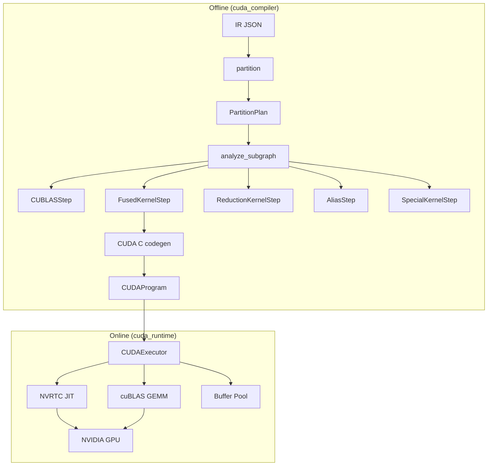

# CUDA Backend Guide

The CUDA backend provides an alternative execution path using NVIDIA GPUs via CuPy. Unlike the Metal backend's op-level codegen (1 ATen op → 1 kernel), the CUDA backend uses **subgraph-level codegen** (N ops → M fused kernels, where M << N).

## Architecture



## Subgraph Compilation Pipeline

```
sub_ir_dict
  → IRGraph (ir_reader.py, reused from npu_compiler)
  → analyze_subgraph(graph) → list[ExecStep]
     ├─ CUBLASStep       (matmul, conv, linear, bmm → cuBLAS)
     ├─ FusionGroup       (elementwise chain → single CUDA kernel)
     ├─ ReductionKernelStep (softmax, mean → custom CUDA kernel)
     ├─ AliasStep         (reshape, view → zero-cost)
     └─ SpecialKernelStep (embedding, rope, index_copy → pre-written)
  → codegen: FusionGroup → CUDA C source (NVRTC JIT)
  → CUDAProgram (steps + buffer allocations)
```

## Op Classification

Operations are classified into 4 categories:

| Category | Ops | Handling |
|----------|-----|----------|
| **ANCHOR_BLAS** | matmul, conv2d, linear, bmm, addmm | cuBLAS (fusion barrier) |
| **ELEMENTWISE** | relu, silu, add, mul, div, neg, pow, rsqrt, cos, sin | Chain fusion → single kernel |
| **REDUCTION** | softmax, mean, pool, batchnorm | Custom CUDA kernel (fusion barrier) |
| **SHAPE_ALIAS** | reshape, view, expand, slice, transpose | Zero-cost alias or kernel |

## Fusion Strategy

The greedy elementwise fusion algorithm:

1. Walk the op graph in topological order
2. For each ELEMENTWISE op, check if its primary input producer is in an existing chain
3. If the producer is single-consumer and shapes match → extend the chain
4. Multi-consumer nodes and non-elementwise ops are **fusion barriers**
5. Each completed chain becomes a single `FusedKernelStep`

**Example** — Qwen MLP (`linear → silu → mul → linear`):

```
Step 0: cuBLAS GEMM (gate_proj)
Step 1: cuBLAS GEMM (up_proj)
Step 2: Fused kernel [silu, mul]  ← single kernel for silu(gate) * up
Step 3: cuBLAS GEMM (down_proj)
```

## Generated Kernel Example

The `[silu, mul]` fusion generates:

```cuda
#include <cuda_fp16.h>
extern "C" {
__global__ void fused_ew_0(const __half* in0, const __half* in1,
                           __half* out0, int N) {
    int idx = blockIdx.x * blockDim.x + threadIdx.x;
    if (idx >= N) return;
    __half v0 = in0[idx];
    __half v1 = (v0 / ((__half)1.0 + hexp(-v0)));  // silu
    __half v2 = in1[idx];
    out0[idx] = (v1 * v2);                          // mul
}
}
```

## Runtime Optimizations

The CUDA executor applies several optimizations beyond basic kernel dispatch:

### CuPy Zero-Copy Views

Tensor manipulation ops (expand, transpose, slice) use CuPy native view operations instead of custom CUDA kernels:

| Op | Kernel Approach | CuPy View Approach |
|----|----------------|-------------------|
| expand | Element-by-element copy kernel | `cp.broadcast_to()` (zero-copy) |
| transpose | Element-by-element copy kernel | `ndarray.transpose()` (zero-copy) |
| slice | Element-by-element copy kernel | `ndarray[slices]` (zero-copy) |
| cat | N/A | `cp.concatenate()` (optimized copy) |

For KV cache tensors (8.4M elements), this reduces view op time from ~200ms to <1ms.

### GQA-Aware Attention Fusion

For models with Grouped Query Attention (e.g., Qwen2.5 with 12 Q heads, 2 KV heads), the compiler detects
the expand→reshape→[transpose]→matmul pattern and replaces it with `gemm_gqa`:

```
Before: expand KV [1,2,1,S,D] → [1,12,S,D] → batch=12 BMM
After:  batch=2 GEMM of [6,D] @ [D,S] per KV head (no expand needed)
```

Pattern matching in `subgraph_analyzer.py` (`_try_match_gqa_attention`) detects two variants:

- **QK^T**: Q=[1,H,1,D] @ K^T=[1,H,D,S] → [kv, q_per_kv, D] @ [kv, D, S]
- **Score×V**: Scores=[1,H,1,S] @ V=[1,H,S,D] → [kv, q_per_kv, S] @ [kv, S, D]

### Fused Reduction Kernels

Multi-op patterns are matched at compile time and executed as single kernels:

| Pattern | Before | After |
|---------|--------|-------|
| RMSNorm | pow→mean→add→rsqrt→mul→mul (6 dispatches) | 1 warp-parallel kernel |
| SiLU+Gate | silu→mul (2 dispatches) | 1 elementwise kernel |
| Masked Softmax | add→softmax (2 dispatches) | 1 warp-parallel kernel |

### NVRTC Kernel Cache

Module-level `_KERNEL_CACHE` stores compiled kernels keyed by `md5(source_code) + kernel_name`.
Survives across CUDAExecutor instances, eliminating redundant NVRTC compilation.

### Dispatch Table Pre-Building

The `run()` hot loop uses a pre-built dispatch table (list of `(dispatch_fn, step)` tuples)
instead of per-step `isinstance()` checks, reducing Python overhead.

## Metal vs CUDA Comparison

| Aspect | Metal Backend | CUDA Backend |
|--------|--------------|-------------|
| Platform | macOS (Apple Silicon) | Linux/Windows (NVIDIA GPU) |
| Runtime | pyobjc + Metal API | CuPy (NVRTC + cuBLAS) |
| Codegen | Op-level (1:1) | Subgraph-level (N:M) |
| Fusion | Pattern-based (Conv+BN+ReLU, etc.) | Greedy elementwise chain + multi-op patterns |
| Channel padding | 64-byte alignment | None (DENSE layout) |
| JIT compiler | Metal shader compiler | NVRTC (with module-level cache) |
| BLAS | MPS MatrixMultiplication | cuBLAS via CuPy |
| GQA optimization | N/A | GQA-aware BMM fusion |
| View ops | Custom Metal kernels | CuPy zero-copy views |
| nvcc required | N/A | No (NVRTC is runtime JIT) |

### Performance Comparison

| Metric | Metal (M4 Pro) | CUDA (RTX 3090 Ti) | Speedup |
|--------|----------------|---------------------|---------|
| TTFT | 359.5 ms | 34.3 ms | 10.5x |
| Peak TPS | 2.8 tok/s | 31.9 tok/s | 11.4x |
| TPS at 32K context | 1.2 tok/s | 30.7 tok/s | 25.6x |

See [Benchmarks](benchmarks.md#cuda-backend-benchmarks) for full scaling results and charts.

## File Structure

```
cuda_compiler/                    # Offline compilation
  __init__.py                     # compile_subgraph() entry point
  op_classify.py                  # OpCategory enum, classify_op()
  op_support.py                   # is_cuda_op_supported()
  subgraph_analyzer.py            # analyze_subgraph() → list[ExecStep]
  cuda_codegen.py                 # generate_fused_kernel()
  cuda_templates.py               # Pre-written CUDA kernel templates
  cuda_program.py                 # CUDAProgram data model
  buffer_planner.py               # Intermediate buffer allocation

cuda_runtime/                     # Online execution
  __init__.py
  cuda_backend.py                 # CUDABackend + CUDABuffer
  cuda_executor.py                # CUDAExecutor (NVRTC + cuBLAS dispatch)
```

## Usage

```python
import json
from cuda_compiler import compile_subgraph
from cuda_compiler.op_support import is_cuda_op_supported
from npu_compiler.partitioner import partition
from npu_runtime.dag_executor import DAGExecutor
from cuda_runtime.cuda_backend import CUDABackend

# Load IR
ir_dict = json.load(open("model_ir.json"))

# Partition
plan = partition(ir_dict, is_cuda_op_supported)

# Execute
backend = CUDABackend()
dag = DAGExecutor(plan, backend, compile_fn=compile_subgraph)
dag.load_weights(weights_dict)
result = dag.execute(inputs={"x": input_np})
```

## Verification

```bash
# Unit tests (no CuPy required — tests offline compilation only)
uv run pytest tests/test_cuda_compiler.py -v

# Integration tests (requires CuPy + NVIDIA GPU)
uv run pytest tests/test_cuda_executor.py tests/test_cuda_fusion.py -v

# DAG executor with CUDA backend
uv run pytest tests/test_dag_executor.py -v -k cuda

# Benchmark
uv run python benchmarks/benchmark_qwen.py --backend cuda
```
