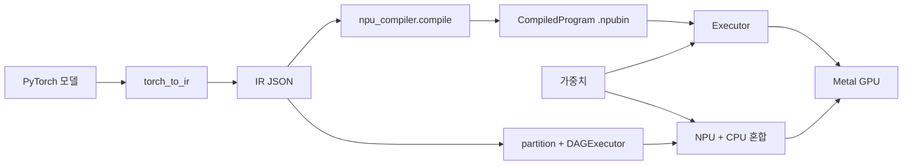

# NPU Simulation

PyTorch IR을 Metal 컴퓨트 셰이더로 컴파일하여 Mac Apple Silicon GPU에서 NPU 실행을 시뮬레이션하는 컴파일러/런타임 백엔드입니다.

## 지원 모델

| 모델 | 상태 | 비고 |
|------|------|------|
| ResNet-18/50 | Full E2E | PyTorch CPU와 Top-5 일치 |
| Qwen2.5-1.5B | Prefill + Decode | BFloat16, index_copy KV 캐시 |

## 빠른 시작

### 1. PyTorch 모델에서 IR 추출

```python
from torch_ir import extract_ir
ir = extract_ir(model, example_input, model_name="my_model")
```

### 2. NPU 프로그램으로 컴파일

```python
import npu_compiler
program = npu_compiler.compile("model_ir.json")
program.save("model.npubin")
```

### 3a. Metal GPU에서 실행 (단일 프로그램 — 모든 op NPU 지원)

```python
from npu_compiler.compiled_program import CompiledProgram
from npu_runtime import Device, Executor, NPUBuffer, load_weights

device = Device()
program = CompiledProgram.load("model.npubin")
executor = Executor(program, device)
weights = load_weights("model.safetensors", program, device)

input_buf = NPUBuffer.from_numpy(input_data, device, spec=program.input_specs[0])
outputs = executor.run(inputs={"input": input_buf}, weights=weights)
result = outputs["output"].to_numpy(spec=program.output_specs[0])
```

### 3b. DAGExecutor로 실행 (혼합 NPU + CPU — 부분 op 지원)

```python
from npu_compiler import partition, is_op_supported
from npu_runtime import DAGExecutor, MetalBackend

plan = partition(ir_dict, is_op_supported)
backend = MetalBackend()
dag = DAGExecutor(plan, backend)
dag.load_weights(weights_dict)
result = dag.execute(inputs={"x": input_array})
```

## 성능

| Phase | 최적화 | Decode 지연 | Dispatch 수 |
|-------|--------|------------|-------------|
| 기준 | 없음 | ~4,900ms | 1,831 |
| Phase 0 | MPS BFloat16 matmul | ~1,100ms | 1,831 |
| Phase 1 | Broadcast 이진 연산 | ~600ms | ~1,521 |
| Phase 2 | Fused RMSNorm | ~300ms | ~1,122 |
| Phase 3 | SiLU+gate, masked softmax | ~150ms | ~1,038 |

## 아키텍처


