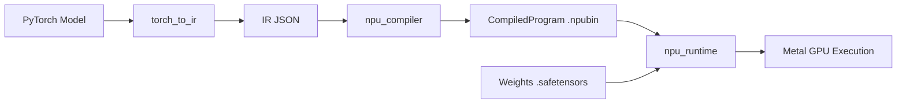

# NPU Simulation

NPU compiler/runtime backend that compiles PyTorch IR to Metal compute shaders, simulating NPU execution on Mac Apple Silicon GPU.

## Supported Models

| Model | Status | Notes |
|-------|--------|-------|
| ResNet-18/50 | Full E2E | Top-5 agreement with PyTorch CPU |
| Qwen2.5-1.5B | Prefill + Decode | BFloat16, KV cache via index_copy |

## Quick Start

### 1. Extract IR from PyTorch model

```python
from torch_ir import extract_ir
ir = extract_ir(model, example_input, model_name="my_model")
```

### 2. Compile to NPU program

```python
from npu_compiler import compile_ir
program = compile_ir("model_ir.json")
program.save("model.npubin")
```

### 3. Execute on Metal GPU

```python
from npu_compiler.compiled_program import CompiledProgram
from npu_runtime.device import Device
from npu_runtime.executor import Executor
from npu_runtime.weight_loader import load_weights
from npu_runtime.buffer import NPUBuffer

device = Device()
program = CompiledProgram.load("model.npubin")
executor = Executor(program, device)
weights = load_weights("model.safetensors", program, device)

input_buf = NPUBuffer.from_numpy(input_data, device, spec=program.input_specs[0])
outputs = executor.run(inputs={"input": input_buf}, weights=weights)
result = outputs["output"].to_numpy(spec=program.output_specs[0])
```

## Performance

| Phase | Optimization | Decode Latency | Dispatches |
|-------|-------------|----------------|------------|
| Baseline | None | ~4,900ms | 1,831 |
| Phase 0 | MPS BFloat16 matmul | ~1,100ms | 1,831 |
| Phase 1 | Broadcast binary ops | ~600ms | ~1,521 |
| Phase 2 | Fused RMSNorm | ~300ms | ~1,122 |
| Phase 3 | SiLU+gate, masked softmax | ~150ms | ~1,038 |

## Architecture


