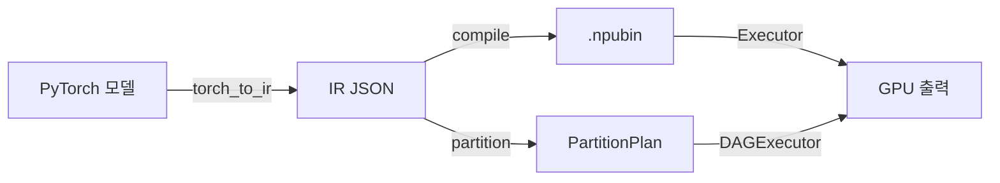

# 사용 가이드

## 워크플로우 개요



## ResNet 예제

### IR 추출 및 실행

```python
import torch
import torchvision.models as models
from torch_ir import extract_ir

# 모델 로드
model = models.resnet18(weights=models.ResNet18_Weights.DEFAULT).eval()
example = torch.randn(1, 3, 224, 224)

# IR 추출
ir = extract_ir(model, example, model_name="resnet18")
ir.save("resnet18_ir.json")
```

### 컴파일 및 실행

```python
import npu_compiler
from npu_compiler.compiled_program import CompiledProgram
from npu_runtime import Device, Executor, NPUBuffer, load_weights

# 컴파일
program = npu_compiler.compile("resnet18_ir.json")
program.save("resnet18.npubin")

# 런타임 설정
device = Device()
program = CompiledProgram.load("resnet18.npubin")
executor = Executor(program, device)
weights = load_weights("resnet18.safetensors", program, device)

# 추론 실행
import numpy as np
input_data = np.random.randn(1, 3, 224, 224).astype(np.float32)
input_buf = NPUBuffer.from_numpy(input_data, device, spec=program.input_specs[0])
outputs = executor.run(inputs={program.input_specs[0].name: input_buf}, weights=weights)
logits = outputs[program.output_specs[0].name].to_numpy(spec=program.output_specs[0])
```

## Qwen2.5-1.5B 예제

Qwen은 **그래프 파티션 파이프라인** (DAGExecutor)을 사용하여 NPU + CPU 혼합 실행합니다.

### DAGExecutor 방식 (권장)
```python
import json
from npu_compiler import partition, is_op_supported
from npu_runtime import DAGExecutor, MetalBackend

ir_dict = json.load(open("qwen_prefill_ir.json"))
plan = partition(ir_dict, is_op_supported)

backend = MetalBackend()
dag = DAGExecutor(plan, backend)
dag.load_weights(weights_dict)

result = dag.execute(inputs={
    "input_ids": input_ids_np,
    "attention_mask": causal_mask_np,
    "position_ids": position_ids_np,
    "cache_position": cache_position_np,
})
logits = list(result.values())[0]
next_token = logits[0, -1, :].argmax()
```

### 단일 Executor 방식 (모든 op NPU 지원 시)
```python
import npu_compiler
from npu_runtime import Device, Executor, load_weights

prefill_program = npu_compiler.compile("qwen_prefill_ir.json")
device = Device()
executor = Executor(prefill_program, device)
weights = load_weights("model.safetensors", prefill_program, device)
outputs = executor.run(inputs={...}, weights=weights)
```

## CUDA 백엔드

CUDA 백엔드는 **서브그래프 수준 컴파일**을 사용합니다: elementwise 연산 체인을 단일 CUDA 커널로 퓨전하고, 무거운 연산(matmul, conv)은 cuBLAS로 디스패치합니다.

### DAGExecutor 방식 (CUDA)
```python
import json
from cuda_compiler import compile_subgraph
from cuda_compiler.op_support import is_cuda_op_supported
from npu_compiler.partitioner import partition
from npu_runtime.dag_executor import DAGExecutor
from cuda_runtime.cuda_backend import CUDABackend

ir_dict = json.load(open("qwen_prefill_ir.json"))
plan = partition(ir_dict, is_cuda_op_supported)

backend = CUDABackend()
dag = DAGExecutor(plan, backend, compile_fn=compile_subgraph)
dag.load_weights(weights_dict)

result = dag.execute(inputs={
    "input_ids": input_ids_np,
    "attention_mask": causal_mask_np,
    "position_ids": position_ids_np,
    "cache_position": cache_position_np,
})
```

아키텍처 상세 및 퓨전 전략은 [CUDA 백엔드 가이드](cuda-backend.md)를 참조하세요.

## 프로파일링

내장 프로파일러로 커널 성능을 측정합니다:

```python
from npu_runtime.profiler import Profiler

profiler = Profiler(executor)
outputs = profiler.run(inputs=inputs, weights=weights)
profiler.print_summary()
```

커널별 총 시간, 호출 횟수, 평균 지속 시간이 출력됩니다.
