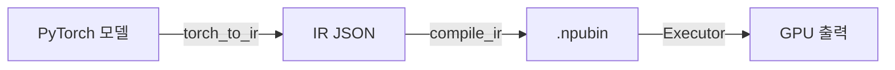

# 사용 가이드

## 워크플로우 개요



## ResNet 예제

### IR 추출 및 실행

```python
import torch
import torchvision.models as models
from torch_ir import extract_ir

# 모델 로드
model = models.resnet18(weights=models.ResNet18_Weights.DEFAULT).eval()
example = torch.randn(1, 3, 224, 224)

# IR 추출
ir = extract_ir(model, example, model_name="resnet18")
ir.save("resnet18_ir.json")
```

### 컴파일 및 실행

```python
from npu_compiler import compile_ir
from npu_compiler.compiled_program import CompiledProgram
from npu_runtime.device import Device
from npu_runtime.executor import Executor
from npu_runtime.weight_loader import load_weights
from npu_runtime.buffer import NPUBuffer

# 컴파일
program = compile_ir("resnet18_ir.json")
program.save("resnet18.npubin")

# 런타임 설정
device = Device()
program = CompiledProgram.load("resnet18.npubin")
executor = Executor(program, device)
weights = load_weights("resnet18.safetensors", program, device)

# 추론 실행
import numpy as np
input_data = np.random.randn(1, 3, 224, 224).astype(np.float32)
input_buf = NPUBuffer.from_numpy(input_data, device, spec=program.input_specs[0])
outputs = executor.run(inputs={program.input_specs[0].name: input_buf}, weights=weights)
logits = outputs[program.output_specs[0].name].to_numpy(spec=program.output_specs[0])
```

## Qwen2.5-1.5B 예제

Qwen은 두 단계를 사용합니다: **프리필** (프롬프트 처리)과 **디코드** (토큰 생성).

### 프리필 단계
```python
# 프리필 IR 컴파일
prefill_program = compile_ir("qwen_prefill_ir.json")
prefill_executor = Executor(prefill_program, device)

# 프롬프트 토큰으로 프리필 실행
prefill_outputs = prefill_executor.run(
    inputs={
        "input_ids": token_buf,
        "attention_mask": mask_buf,
        "position_ids": pos_buf,
    },
    weights=weights,
)
```

### 디코드 단계
```python
# 디코드 IR 컴파일 (단일 토큰, KV 캐시)
decode_program = compile_ir("qwen_decode_ir.json")
decode_executor = Executor(decode_program, device)

# 자기회귀 생성
for step in range(max_tokens):
    outputs = decode_executor.run(
        inputs={
            "input_ids": next_token_buf,
            "cache_position": cache_pos_buf,
            "position_ids": pos_buf,
            "attention_mask": mask_buf,
        },
        weights=weights,
    )
    next_token = outputs["logits"].to_numpy(spec=...).argmax()
```

## 프로파일링

내장 프로파일러로 커널 성능을 측정합니다:

```python
from npu_runtime.profiler import Profiler

profiler = Profiler(executor)
outputs = profiler.run(inputs=inputs, weights=weights)
profiler.print_summary()
```

커널별 총 시간, 호출 횟수, 평균 지속 시간이 출력됩니다.
