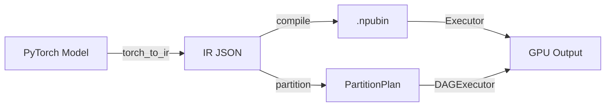

# Usage Guide

## Workflow Overview



## ResNet Example

### Extract IR and Run

```python
import torch
import torchvision.models as models
from torch_ir import extract_ir

# Load model
model = models.resnet18(weights=models.ResNet18_Weights.DEFAULT).eval()
example = torch.randn(1, 3, 224, 224)

# Extract IR
ir = extract_ir(model, example, model_name="resnet18")
ir.save("resnet18_ir.json")
```

### Compile and Execute

```python
import npu_compiler
from npu_compiler.compiled_program import CompiledProgram
from npu_runtime import Device, Executor, NPUBuffer, load_weights

# Compile
program = npu_compiler.compile("resnet18_ir.json")
program.save("resnet18.npubin")

# Setup runtime
device = Device()
program = CompiledProgram.load("resnet18.npubin")
executor = Executor(program, device)
weights = load_weights("resnet18.safetensors", program, device)

# Run inference
import numpy as np
input_data = np.random.randn(1, 3, 224, 224).astype(np.float32)
input_buf = NPUBuffer.from_numpy(input_data, device, spec=program.input_specs[0])
outputs = executor.run(inputs={program.input_specs[0].name: input_buf}, weights=weights)
logits = outputs[program.output_specs[0].name].to_numpy(spec=program.output_specs[0])
```

## Qwen2.5-1.5B Example

Qwen uses the **graph partition pipeline** (DAGExecutor) for mixed NPU + CPU execution.

### Via DAGExecutor (recommended)
```python
import json
from npu_compiler import partition, is_op_supported
from npu_runtime import DAGExecutor, MetalBackend

ir_dict = json.load(open("qwen_prefill_ir.json"))
plan = partition(ir_dict, is_op_supported)

backend = MetalBackend()
dag = DAGExecutor(plan, backend)
dag.load_weights(weights_dict)

result = dag.execute(inputs={
    "input_ids": input_ids_np,
    "attention_mask": causal_mask_np,
    "position_ids": position_ids_np,
    "cache_position": cache_position_np,
})
logits = list(result.values())[0]
next_token = logits[0, -1, :].argmax()
```

### Via single Executor (all ops NPU-supported)
```python
import npu_compiler
from npu_runtime import Device, Executor, load_weights

prefill_program = npu_compiler.compile("qwen_prefill_ir.json")
device = Device()
executor = Executor(prefill_program, device)
weights = load_weights("model.safetensors", prefill_program, device)
outputs = executor.run(inputs={...}, weights=weights)
```

## Profiling

Use the built-in profiler to measure kernel performance:

```python
from npu_runtime.profiler import Profiler

profiler = Profiler(executor)
outputs = profiler.run(inputs=inputs, weights=weights)
profiler.print_summary()
```

This prints per-kernel timing with total time, call count, and average duration.
